# HƯỚNG DẪN VỀ SƠ ĐỒ USE CASE - HỆ THỐNG BÌNH PHƯỚC SHOP

## 1. GIỚI THIỆU VỀ USE CASE DIAGRAM

### 1.1. Use Case Diagram là gì?

Use Case Diagram là một loại biểu đồ trong UML (Unified Modeling Language) được sử dụng để mô tả các chức năng của hệ thống từ góc nhìn của người dùng. Nó giúp xác định các yêu cầu chức năng của hệ thống và mối quan hệ giữa các actors (tác nhân) và use cases (trường hợp sử dụng).

### 1.2. Các thành phần cơ bản

1. **Actor** (Tác nhân): Đại diện cho người dùng hoặc hệ thống bên ngoài
2. **Use Case** (Trường hợp sử dụng): Chức năng cụ thể của hệ thống
3. **System Boundary** (Ranh giới hệ thống): Hình chữ nhật bao quanh các use cases
4. **Association** (Liên kết): Đường thẳng nối actor và use case
5. **Include** (Bao gồm): Use case này luôn được gọi khi use case khác thực thi
6. **Extend** (Mở rộng): Use case này có thể được gọi tùy chọn
7. **Generalization** (Kế thừa): Mối quan hệ kế thừa giữa actors hoặc use cases

---

## 2. CÁC ACTORS (TÁC NHÂN) TRONG HỆ THỐNG

### 2.1. Danh sách Actors

| Actor | Mô tả | Vai trò |
|-------|-------|---------|
| **Khách hàng (Guest)** | Người dùng chưa đăng nhập | Xem sản phẩm, tìm kiếm, xem blog, liên hệ |
| **Khách hàng (Customer)** | Người dùng đã đăng ký/đăng nhập | Tất cả quyền của Guest + Đặt hàng, quản lý tài khoản |
| **Quản trị viên (Admin)** | Người quản trị hệ thống | Toàn quyền quản lý hệ thống |
| **Quản lý (Manager)** | Người quản lý (có thể mở rộng) | Quyền quản trị (tương tự Admin) |

### 2.2. Mối quan hệ giữa các Actors

```
Guest (Khách hàng chưa đăng nhập)
    ↓ (đăng ký/đăng nhập)
Customer (Khách hàng đã đăng nhập)
    ↓ (được cấp quyền)
Manager (Quản lý)
    ↓ (quyền cao nhất)
Admin (Quản trị viên)
```

---

## 3. USE CASES CHO TỪNG ACTOR

### 3.1. USE CASES CHO GUEST (Khách hàng chưa đăng nhập)

#### **3.1.1. Xem thông tin website**

| Use Case ID | Use Case Name | Mô tả | Controller | Action |
|-------------|---------------|-------|------------|--------|
| UC-001 | Xem trang chủ | Xem slider, sản phẩm nổi bật, danh mục | HomeController | Index |
| UC-002 | Xem danh sách sản phẩm | Xem tất cả sản phẩm với filter, sort, pagination | ProductsController | Index |
| UC-003 | Xem chi tiết sản phẩm | Xem thông tin chi tiết, ảnh, giá của sản phẩm | ProductsController | Detail |
| UC-004 | Xem sản phẩm theo danh mục | Xem sản phẩm theo danh mục (giày nam, giày nữ, dép nam, dép nữ, phụ kiện) | CollectionsController | Index |
| UC-005 | Tìm kiếm sản phẩm | Tìm kiếm sản phẩm theo từ khóa | ProductsController | Index (q parameter) |
| UC-006 | Xem blog | Xem danh sách bài viết blog | BlogController | Index |
| UC-007 | Xem chi tiết bài viết | Xem nội dung chi tiết bài viết | BlogController | Detail |
| UC-008 | Xem trang giới thiệu | Xem thông tin về cửa hàng | PagesController | GioiThieu |
| UC-009 | Xem các trang chính sách | Xem chính sách vận chuyển, đổi trả, bảo hành, v.v. | PagesController | Privacy |
| UC-010 | Xem liên hệ | Xem thông tin liên hệ của cửa hàng | ContactController | Index |

#### **3.1.2. Tương tác với website**

| Use Case ID | Use Case Name | Mô tả | Controller | Action |
|-------------|---------------|-------|------------|--------|
| UC-011 | Gửi tin nhắn liên hệ | Gửi form liên hệ với thông tin cá nhân | ContactController | Index (POST) |
| UC-012 | Đăng ký tài khoản | Tạo tài khoản mới với đầy đủ thông tin (Họ tên, Email, Số điện thoại, Địa chỉ, Mật khẩu) | AccountController | Register |
| UC-013 | Đăng nhập | Đăng nhập vào hệ thống | AccountController | Login |

---

### 3.2. USE CASES CHO CUSTOMER (Khách hàng đã đăng nhập)

#### **3.2.1. Quản lý tài khoản**

| Use Case ID | Use Case Name | Mô tả | Controller | Action |
|-------------|---------------|-------|------------|--------|
| UC-014 | Xem thông tin cá nhân | Xem profile của mình | AccountController | Profile |
| UC-015 | Cập nhật thông tin cá nhân | Sửa tên, số điện thoại, địa chỉ | AccountController | UpdateProfile |
| UC-016 | Đổi mật khẩu | Thay đổi mật khẩu tài khoản | AccountController | ChangePassword |
| UC-017 | Đăng xuất | Đăng xuất khỏi hệ thống | AccountController | Logout |

#### **3.2.2. Mua sắm**

| Use Case ID | Use Case Name | Mô tả | Controller | Action |
|-------------|---------------|-------|------------|--------|
| UC-018 | Thêm sản phẩm vào giỏ hàng | Thêm sản phẩm với số lượng, size vào giỏ | CartController | Add |
| UC-019 | Xem giỏ hàng | Xem danh sách sản phẩm trong giỏ | CartController | Index |
| UC-020 | Cập nhật số lượng sản phẩm | Thay đổi số lượng sản phẩm trong giỏ | CartController | Update |
| UC-021 | Xóa sản phẩm khỏi giỏ hàng | Xóa sản phẩm khỏi giỏ | CartController | Remove |
| UC-022 | Xóa toàn bộ giỏ hàng | Xóa tất cả sản phẩm trong giỏ | CartController | Clear |
| UC-023 | Đặt hàng | Tạo đơn hàng từ giỏ hàng | CheckoutController | Index, Process |
| UC-024 | Xem lịch sử đơn hàng | Xem các đơn hàng đã đặt (nếu có tính năng) | CheckoutController | Success |

---

### 3.3. USE CASES CHO ADMIN (Quản trị viên)

#### **3.3.1. Đăng nhập và Dashboard**

| Use Case ID | Use Case Name | Mô tả | Controller | Action |
|-------------|---------------|-------|------------|--------|
| UC-025 | Đăng nhập Admin | Đăng nhập vào trang quản trị | Areas/Admin/AccountController | Login |
| UC-026 | Xem Dashboard | Xem tổng quan thống kê hệ thống (Doanh thu, Đơn hàng, Sản phẩm, Người dùng) | Areas/Admin/DashboardController | Index |
| UC-027 | Đăng xuất Admin | Đăng xuất khỏi trang quản trị | Areas/Admin/AccountController | Logout |

#### **3.3.2. Quản lý sản phẩm**

| Use Case ID | Use Case Name | Mô tả | Controller | Action |
|-------------|---------------|-------|------------|--------|
| UC-028 | Xem danh sách sản phẩm | Xem tất cả sản phẩm với filter, search, pagination | Areas/Admin/ProductsController | Index |
| UC-029 | Thêm sản phẩm mới | Tạo sản phẩm mới với đầy đủ thông tin (Tên, Mô tả, Giá, Danh mục, Thương hiệu, Ảnh) | Areas/Admin/ProductsController | Create |
| UC-030 | Sửa thông tin sản phẩm | Cập nhật thông tin sản phẩm | Areas/Admin/ProductsController | Edit |
| UC-031 | Xóa sản phẩm | Xóa sản phẩm khỏi hệ thống | Areas/Admin/ProductsController | Delete |
| UC-032 | Upload ảnh sản phẩm | Upload một hoặc nhiều ảnh cho sản phẩm | Areas/Admin/ProductsController | Create, Edit |
| UC-033 | Quản lý tồn kho | Cập nhật số lượng tồn kho | Areas/Admin/ProductsController | Edit |
| UC-034 | Đánh dấu sản phẩm nổi bật | Đặt sản phẩm là featured | Areas/Admin/ProductsController | Edit |

#### **3.3.3. Quản lý danh mục**

| Use Case ID | Use Case Name | Mô tả | Controller | Action |
|-------------|---------------|-------|------------|--------|
| UC-035 | Xem danh sách danh mục | Xem tất cả danh mục sản phẩm với số lượng sản phẩm | Areas/Admin/CategoriesController | Index |
| UC-036 | Thêm danh mục mới | Tạo danh mục mới | Areas/Admin/CategoriesController | Create |
| UC-037 | Sửa danh mục | Cập nhật thông tin danh mục | Areas/Admin/CategoriesController | Edit |
| UC-038 | Xóa danh mục | Xóa danh mục (chỉ khi không có sản phẩm) | Areas/Admin/CategoriesController | Delete |
| UC-039 | Xóa sản phẩm theo danh mục | Xóa tất cả sản phẩm thuộc một danh mục | Areas/Admin/CategoriesController | DeleteCategoryProducts |
| UC-040 | Xóa nhiều danh mục | Xóa nhiều danh mục đã chọn | Areas/Admin/CategoriesController | DeleteSelected |
| UC-041 | Xóa tất cả danh mục | Xóa tất cả danh mục (chỉ những danh mục không có sản phẩm) | Areas/Admin/CategoriesController | DeleteAll |

#### **3.3.4. Quản lý thương hiệu**

| Use Case ID | Use Case Name | Mô tả | Controller | Action |
|-------------|---------------|-------|------------|--------|
| UC-042 | Xem danh sách thương hiệu | Xem tất cả thương hiệu | Areas/Admin/BrandsController | Index |
| UC-043 | Thêm thương hiệu mới | Tạo thương hiệu mới | Areas/Admin/BrandsController | Create |
| UC-044 | Sửa thương hiệu | Cập nhật thông tin thương hiệu | Areas/Admin/BrandsController | Edit |
| UC-045 | Xóa thương hiệu | Xóa thương hiệu | Areas/Admin/BrandsController | Delete |
| UC-046 | Upload logo thương hiệu | Upload logo cho thương hiệu | Areas/Admin/BrandsController | Create, Edit |

#### **3.3.5. Quản lý bài viết (Blog)**

| Use Case ID | Use Case Name | Mô tả | Controller | Action |
|-------------|---------------|-------|------------|--------|
| UC-047 | Xem danh sách bài viết | Xem tất cả bài viết blog | Areas/Admin/PostsController | Index |
| UC-048 | Thêm bài viết mới | Tạo bài viết blog mới | Areas/Admin/PostsController | Create |
| UC-049 | Sửa bài viết | Cập nhật nội dung bài viết | Areas/Admin/PostsController | Edit |
| UC-050 | Xóa bài viết | Xóa bài viết | Areas/Admin/PostsController | Delete |
| UC-051 | Upload ảnh bài viết | Upload ảnh đại diện cho bài viết | Areas/Admin/PostsController | Create, Edit |

#### **3.3.6. Quản lý đơn hàng**

| Use Case ID | Use Case Name | Mô tả | Controller | Action |
|-------------|---------------|-------|------------|--------|
| UC-052 | Xem danh sách đơn hàng | Xem tất cả đơn hàng với filter, search, pagination | Areas/Admin/OrdersController | Index |
| UC-053 | Xem chi tiết đơn hàng | Xem thông tin chi tiết đơn hàng và sản phẩm | Areas/Admin/OrdersController | Detail |
| UC-054 | Cập nhật trạng thái đơn hàng | Thay đổi trạng thái (pending, confirmed, shipping, completed, cancelled) | Areas/Admin/OrdersController | UpdateStatus |
| UC-055 | In hóa đơn | In hóa đơn đơn hàng | Areas/Admin/OrdersController | Print (client-side) |

#### **3.3.7. Quản lý tin nhắn liên hệ**

| Use Case ID | Use Case Name | Mô tả | Controller | Action |
|-------------|---------------|-------|------------|--------|
| UC-056 | Xem danh sách tin nhắn | Xem tất cả tin nhắn liên hệ | Areas/Admin/ContactMessagesController | Index |
| UC-057 | Xem chi tiết tin nhắn | Xem nội dung chi tiết tin nhắn | Areas/Admin/ContactMessagesController | Detail |
| UC-058 | Đánh dấu đã đọc | Đánh dấu tin nhắn là đã đọc | Areas/Admin/ContactMessagesController | MarkAsRead |
| UC-059 | Xóa tin nhắn | Xóa tin nhắn liên hệ | Areas/Admin/ContactMessagesController | Delete |

#### **3.3.8. Quản lý người dùng**

| Use Case ID | Use Case Name | Mô tả | Controller | Action |
|-------------|---------------|-------|------------|--------|
| UC-060 | Xem danh sách người dùng | Xem tất cả người dùng với filter, search, pagination, thống kê | Areas/Admin/UsersController | Index |
| UC-061 | Thêm người dùng mới | Tạo tài khoản người dùng mới với đầy đủ thông tin | Areas/Admin/UsersController | Create |
| UC-062 | Sửa thông tin người dùng | Cập nhật thông tin người dùng, xem thống kê đơn hàng | Areas/Admin/UsersController | Edit |
| UC-063 | Xóa người dùng | Xóa tài khoản người dùng (chỉ khi không có đơn hàng) | Areas/Admin/UsersController | Delete |
| UC-064 | Cấp quyền Admin/Manager | Thay đổi role của người dùng | Areas/Admin/UsersController | Edit |
| UC-065 | Kích hoạt/Vô hiệu hóa tài khoản | Bật/tắt tài khoản người dùng | Areas/Admin/UsersController | ToggleStatus |
| UC-066 | Cấp tài khoản Admin | Tạo tài khoản Admin mới | Areas/Admin/UsersController | Create (role=Admin) |

#### **3.3.9. Cài đặt website**

| Use Case ID | Use Case Name | Mô tả | Controller | Action |
|-------------|---------------|-------|------------|--------|
| UC-067 | Xem cài đặt website | Xem các cài đặt hiện tại | Areas/Admin/SettingsController | Index |
| UC-068 | Cập nhật thông tin website | Sửa tên, mô tả, liên hệ website | Areas/Admin/SettingsController | Save |
| UC-069 | Quản lý ảnh trang chủ | Upload và quản lý 4 ảnh chính trang chủ (HeroBackground, BannerGiayNam, BannerGiayNu, BannerDepNam) | Areas/Admin/SettingsController | UploadHomeImage |
| UC-070 | Quản lý banner các trang | Upload và quản lý banner cho các trang (Giới thiệu, Blog, Liên hệ, Sản phẩm) | Areas/Admin/SettingsController | UploadHomeImage |
| UC-071 | Quản lý banner/ảnh chung | Upload banner/ảnh/video chung | Areas/Admin/SettingsController | UploadBanner |
| UC-072 | Xóa banner/ảnh | Xóa banner/ảnh đã upload | Areas/Admin/SettingsController | DeleteImage |

#### **3.3.10. Quản lý trang tĩnh**

| Use Case ID | Use Case Name | Mô tả | Controller | Action |
|-------------|---------------|-------|------------|--------|
| UC-073 | Xem danh sách trang | Xem các trang tĩnh | Areas/Admin/PagesController | Index |
| UC-074 | Sửa trang giới thiệu | Cập nhật nội dung trang giới thiệu | Areas/Admin/PagesController | EditGioiThieu |

#### **3.3.11. Quản lý profile cá nhân (Admin)**

| Use Case ID | Use Case Name | Mô tả | Controller | Action |
|-------------|---------------|-------|------------|--------|
| UC-075 | Xem profile Admin | Xem thông tin cá nhân | Areas/Admin/ProfileController | Index |
| UC-076 | Cập nhật profile Admin | Sửa thông tin cá nhân | Areas/Admin/ProfileController | UpdateProfile |
| UC-077 | Đổi mật khẩu Admin | Thay đổi mật khẩu | Areas/Admin/ProfileController | ChangePassword |

#### **3.3.12. Xem nhật ký hoạt động**

| Use Case ID | Use Case Name | Mô tả | Controller | Action |
|-------------|---------------|-------|------------|--------|
| UC-078 | Xem nhật ký hoạt động | Xem log các thao tác trong hệ thống với filter | Areas/Admin/ActivityLogsController | Index |
| UC-079 | Lọc nhật ký theo user/action | Tìm kiếm log theo hành động và loại entity | Areas/Admin/ActivityLogsController | Index (filters) |

---

## 4. MỐI QUAN HỆ GIỮA CÁC USE CASES

### 4.1. Include Relationship (Bao gồm)

| Use Case chính | Include | Use Case được include |
|----------------|---------|----------------------|
| UC-022 (Xóa toàn bộ giỏ hàng) | <<include>> | UC-021 (Xóa sản phẩm khỏi giỏ hàng) |
| UC-023 (Đặt hàng) | <<include>> | UC-019 (Xem giỏ hàng) |
| UC-023 (Đặt hàng) | <<include>> | UC-020 (Cập nhật số lượng) |
| UC-029 (Thêm sản phẩm) | <<include>> | UC-032 (Upload ảnh sản phẩm) |
| UC-030 (Sửa sản phẩm) | <<include>> | UC-032 (Upload ảnh sản phẩm) |
| UC-043 (Thêm thương hiệu) | <<include>> | UC-046 (Upload logo) |
| UC-048 (Thêm bài viết) | <<include>> | UC-051 (Upload ảnh bài viết) |
| UC-052 (Xem danh sách đơn hàng) | <<include>> | UC-053 (Xem chi tiết đơn hàng) |
| UC-056 (Xem danh sách tin nhắn) | <<include>> | UC-057 (Xem chi tiết tin nhắn) |
| UC-060 (Xem danh sách người dùng) | <<include>> | UC-062 (Sửa thông tin người dùng) |

### 4.2. Extend Relationship (Mở rộng)

| Use Case chính | Extend | Use Case mở rộng |
|----------------|--------|------------------|
| UC-002 (Xem danh sách sản phẩm) | <<extend>> | UC-005 (Tìm kiếm sản phẩm) |
| UC-002 (Xem danh sách sản phẩm) | <<extend>> | UC-004 (Xem sản phẩm theo danh mục) |
| UC-003 (Xem chi tiết sản phẩm) | <<extend>> | UC-018 (Thêm vào giỏ hàng) - chỉ Customer |
| UC-023 (Đặt hàng) | <<extend>> | UC-013 (Đăng nhập) - nếu chưa đăng nhập |

---

## 5. CÁC MODULE CHI TIẾT TRONG HỆ THỐNG

### 5.1. MODULE QUẢN LÝ SẢN PHẨM (Admin)

**Mô tả**: Module quản lý toàn bộ sản phẩm của cửa hàng, bao gồm thêm, sửa, xóa, upload ảnh, quản lý tồn kho.

**Các chức năng chính**:
- **UC-028**: Xem danh sách sản phẩm với filter theo trạng thái (tất cả, đang hiển thị, đã ẩn)
- **UC-029**: Thêm sản phẩm mới với đầy đủ thông tin:
  - Tên sản phẩm, Slug, Mô tả ngắn, Mô tả đầy đủ
  - Danh mục, Thương hiệu
  - Giá gốc, Giá khuyến mãi
  - Số lượng tồn kho
  - Upload nhiều ảnh sản phẩm
  - Đánh dấu sản phẩm nổi bật
  - Thứ tự hiển thị
- **UC-030**: Sửa thông tin sản phẩm (tương tự thêm mới)
- **UC-031**: Xóa sản phẩm (có xác nhận)
- **UC-032**: Upload ảnh sản phẩm (hỗ trợ nhiều ảnh)
- **UC-033**: Quản lý tồn kho (cập nhật số lượng)
- **UC-034**: Đánh dấu sản phẩm nổi bật

**Controller**: `Areas/Admin/Controllers/ProductsController.cs`
**Views**: 
- `Areas/Admin/Views/Products/Index.cshtml` - Danh sách sản phẩm
- `Areas/Admin/Views/Products/Create.cshtml` - Thêm sản phẩm
- `Areas/Admin/Views/Products/Edit.cshtml` - Sửa sản phẩm

**Model**: `Models/Product.cs`

---

### 5.2. MODULE QUẢN LÝ DANH MỤC (Admin)

**Mô tả**: Module quản lý danh mục sản phẩm, bao gồm 5 danh mục chính: Giày nam, Giày nữ, Dép nam, Dép nữ, Phụ kiện.

**Các chức năng chính**:
- **UC-035**: Xem danh sách danh mục với số lượng sản phẩm trong mỗi danh mục
- **UC-036**: Thêm danh mục mới:
  - Tên danh mục, Slug (giay-nam, giay-nu, dep-nam, dep-nu, phu-kien)
  - Mô tả
  - Danh mục cha (nếu có)
  - Thứ tự hiển thị
  - Trạng thái (Hiển thị/Ẩn)
- **UC-037**: Sửa danh mục
- **UC-038**: Xóa danh mục (chỉ khi không có sản phẩm)
- **UC-039**: Xóa sản phẩm theo danh mục (xóa tất cả sản phẩm thuộc một danh mục)
- **UC-040**: Xóa nhiều danh mục đã chọn
- **UC-041**: Xóa tất cả danh mục (chỉ những danh mục không có sản phẩm)

**Controller**: `Areas/Admin/Controllers/CategoriesController.cs`
**Views**: 
- `Areas/Admin/Views/Categories/Index.cshtml` - Danh sách danh mục với các nút xóa
- `Areas/Admin/Views/Categories/Create.cshtml` - Thêm danh mục
- `Areas/Admin/Views/Categories/Edit.cshtml` - Sửa danh mục

**Model**: `Models/Category.cs`

---

### 5.3. MODULE QUẢN LÝ THƯƠNG HIỆU (Admin)

**Mô tả**: Module quản lý thương hiệu sản phẩm.

**Các chức năng chính**:
- **UC-042**: Xem danh sách thương hiệu
- **UC-043**: Thêm thương hiệu mới:
  - Tên thương hiệu, Slug
  - Upload logo
  - Mô tả
  - Thứ tự hiển thị
  - Trạng thái
- **UC-044**: Sửa thương hiệu
- **UC-045**: Xóa thương hiệu
- **UC-046**: Upload logo thương hiệu

**Controller**: `Areas/Admin/Controllers/BrandsController.cs`
**Views**: 
- `Areas/Admin/Views/Brands/Index.cshtml` - Danh sách thương hiệu
- `Areas/Admin/Views/Brands/Create.cshtml` - Thêm thương hiệu
- `Areas/Admin/Views/Brands/Edit.cshtml` - Sửa thương hiệu

**Model**: `Models/Brand.cs`

---

### 5.4. MODULE QUẢN LÝ BÀI VIẾT BLOG (Admin)

**Mô tả**: Module quản lý nội dung blog của website.

**Các chức năng chính**:
- **UC-047**: Xem danh sách bài viết
- **UC-048**: Thêm bài viết mới:
  - Tiêu đề, Slug
  - Mô tả ngắn, Nội dung đầy đủ (HTML)
  - Upload ảnh đại diện
  - Danh mục blog
  - Ngày xuất bản
  - Trạng thái
- **UC-049**: Sửa bài viết
- **UC-050**: Xóa bài viết
- **UC-051**: Upload ảnh bài viết

**Controller**: `Areas/Admin/Controllers/PostsController.cs`
**Views**: 
- `Areas/Admin/Views/Posts/Index.cshtml` - Danh sách bài viết
- `Areas/Admin/Views/Posts/Create.cshtml` - Thêm bài viết
- `Areas/Admin/Views/Posts/Edit.cshtml` - Sửa bài viết

**Model**: `Models/Post.cs`

---

### 5.5. MODULE QUẢN LÝ ĐƠN HÀNG (Admin)

**Mô tả**: Module quản lý toàn bộ đơn hàng của khách hàng.

**Các chức năng chính**:
- **UC-052**: Xem danh sách đơn hàng với filter theo trạng thái:
  - Tất cả
  - Chờ xử lý (pending)
  - Đã xác nhận (confirmed)
  - Đang giao (shipping)
  - Hoàn thành (completed)
  - Đã hủy (cancelled)
- **UC-053**: Xem chi tiết đơn hàng:
  - Thông tin khách hàng
  - Danh sách sản phẩm trong đơn
  - Tổng tiền
  - Trạng thái đơn hàng
  - Link đến trang chi tiết sản phẩm trên website
- **UC-054**: Cập nhật trạng thái đơn hàng
- **UC-055**: In hóa đơn (client-side print)

**Controller**: `Areas/Admin/Controllers/OrdersController.cs`
**Views**: 
- `Areas/Admin/Views/Orders/Index.cshtml` - Danh sách đơn hàng
- `Areas/Admin/Views/Orders/Detail.cshtml` - Chi tiết đơn hàng

**Model**: `Models/Order.cs`, `Models/OrderItem.cs`

---

### 5.6. MODULE QUẢN LÝ TIN NHẮN LIÊN HỆ (Admin)

**Mô tả**: Module quản lý tin nhắn liên hệ từ khách hàng.

**Các chức năng chính**:
- **UC-056**: Xem danh sách tin nhắn với badge hiển thị số tin nhắn chưa đọc
- **UC-057**: Xem chi tiết tin nhắn:
  - Họ tên, Email, Số điện thoại
  - Tiêu đề, Nội dung
  - Ngày gửi
- **UC-058**: Đánh dấu đã đọc
- **UC-059**: Xóa tin nhắn

**Controller**: `Areas/Admin/Controllers/ContactMessagesController.cs`
**Views**: 
- `Areas/Admin/Views/ContactMessages/Index.cshtml` - Danh sách tin nhắn
- `Areas/Admin/Views/ContactMessages/Detail.cshtml` - Chi tiết tin nhắn

**Model**: `Models/ContactMessage.cs`

---

### 5.7. MODULE QUẢN LÝ NGƯỜI DÙNG (Admin)

**Mô tả**: Module quản lý toàn bộ người dùng hệ thống, bao gồm khách hàng và admin.

**Các chức năng chính**:
- **UC-060**: Xem danh sách người dùng với:
  - Thống kê: Tổng người dùng, Admin, Manager, Customer, Đang hoạt động, Đã khóa
  - Filter theo vai trò (Tất cả, Admin, Manager, Customer)
  - Tìm kiếm theo tên hoặc email
  - Pagination
- **UC-061**: Thêm người dùng mới với đầy đủ thông tin:
  - Họ tên, Email, Mật khẩu
  - Số điện thoại, Địa chỉ (bắt buộc)
  - Vai trò (Customer, Manager, Admin)
  - Trạng thái (Hoạt động/Khóa)
- **UC-062**: Sửa thông tin người dùng:
  - Cập nhật thông tin cá nhân
  - Đổi mật khẩu (tùy chọn)
  - Thay đổi vai trò
  - Xem thống kê đơn hàng của user
- **UC-063**: Xóa người dùng (chỉ khi không có đơn hàng)
- **UC-064**: Cấp quyền Admin/Manager (thay đổi role)
- **UC-065**: Kích hoạt/Vô hiệu hóa tài khoản
- **UC-066**: Cấp tài khoản Admin (từ menu riêng)

**Controller**: `Areas/Admin/Controllers/UsersController.cs`
**Views**: 
- `Areas/Admin/Views/Users/Index.cshtml` - Danh sách người dùng với thống kê
- `Areas/Admin/Views/Users/Create.cshtml` - Thêm người dùng
- `Areas/Admin/Views/Users/Edit.cshtml` - Sửa người dùng với thống kê đơn hàng

**Model**: `Models/User.cs`

---

### 5.8. MODULE CÀI ĐẶT WEBSITE (Admin)

**Mô tả**: Module quản lý cài đặt chung của website và banner/ảnh.

**Các chức năng chính**:
- **UC-067**: Xem cài đặt website trong tab "Cài đặt cơ bản"
- **UC-068**: Cập nhật thông tin website (Key-Value pairs)
- **UC-069**: Quản lý 4 ảnh chính trang chủ:
  - HeroBackground (1920x600px)
  - BannerGiayNam (600x400px)
  - BannerGiayNu (600x400px)
  - BannerDepNam (600x400px)
- **UC-070**: Quản lý banner các trang:
  - BannerGioiThieu (1920x300px)
  - BannerBlog (1920x300px)
  - BannerLienHe (1920x300px)
  - BannerSanPham (1920x300px)
- **UC-071**: Upload banner/ảnh/video chung (hỗ trợ JPG, PNG, GIF, MP4, WebM)
- **UC-072**: Xóa banner/ảnh đã upload

**Controller**: `Areas/Admin/Controllers/SettingsController.cs`
**Views**: 
- `Areas/Admin/Views/Settings/Index.cshtml` - Trang cài đặt với tabs

**Model**: `Models/SiteSetting.cs`

---

### 5.9. MODULE GIỎ HÀNG VÀ ĐẶT HÀNG (Customer)

**Mô tả**: Module quản lý giỏ hàng và quy trình đặt hàng của khách hàng.

**Các chức năng chính**:
- **UC-018**: Thêm sản phẩm vào giỏ hàng:
  - Lưu trong Session
  - Cập nhật số lượng nếu sản phẩm đã có trong giỏ
- **UC-019**: Xem giỏ hàng:
  - Hiển thị danh sách sản phẩm
  - Tổng tiền
  - Cập nhật số lượng bằng AJAX
- **UC-020**: Cập nhật số lượng sản phẩm (AJAX)
- **UC-021**: Xóa sản phẩm khỏi giỏ hàng
- **UC-022**: Xóa toàn bộ giỏ hàng
- **UC-023**: Đặt hàng:
  - Nhập thông tin giao hàng (Tên, SĐT, Email, Địa chỉ)
  - Tạo đơn hàng trong database
  - Xóa giỏ hàng sau khi đặt hàng thành công
  - Hiển thị mã đơn hàng
- **UC-024**: Xem trang thành công đặt hàng

**Controller**: 
- `Controllers/CartController.cs` - Quản lý giỏ hàng
- `Controllers/CheckoutController.cs` - Quy trình đặt hàng

**Views**: 
- `Views/Cart/Index.cshtml` - Trang giỏ hàng
- `Views/Checkout/Index.cshtml` - Trang đặt hàng
- `Views/Checkout/Success.cshtml` - Trang thành công

**Service**: `Services/CartService.cs` - Xử lý logic giỏ hàng

---

### 5.10. MODULE QUẢN LÝ TÀI KHOẢN NGƯỜI DÙNG (Customer)

**Mô tả**: Module quản lý tài khoản cá nhân của khách hàng.

**Các chức năng chính**:
- **UC-014**: Xem thông tin cá nhân:
  - Họ tên, Email (readonly)
  - Số điện thoại, Địa chỉ
  - Ngày đăng ký
  - Vai trò, Trạng thái
- **UC-015**: Cập nhật thông tin cá nhân:
  - Sửa Họ tên, Số điện thoại, Địa chỉ (bắt buộc)
  - Validation định dạng số điện thoại (10-11 chữ số)
- **UC-016**: Đổi mật khẩu:
  - Nhập mật khẩu hiện tại
  - Nhập mật khẩu mới và xác nhận
  - Validation mật khẩu tối thiểu 6 ký tự

**Controller**: `Controllers/AccountController.cs`
**Views**: 
- `Views/Account/Profile.cshtml` - Trang quản lý tài khoản với layout 2 cột

**Model**: `Models/User.cs`

---

### 5.11. MODULE DASHBOARD ADMIN

**Mô tả**: Module tổng quan hệ thống với thống kê và biểu đồ.

**Các chức năng chính**:
- **UC-026**: Xem Dashboard với:
  - 4 Report Cards: Tổng doanh thu, Tổng đơn hàng, Sản phẩm, Người dùng
  - Thống kê người dùng chi tiết: Tổng, Admin, Manager, Customer, Đang hoạt động, Đã khóa
  - Biểu đồ doanh thu theo ngày (ApexCharts Line Chart)
  - Biểu đồ doanh thu theo trạng thái đơn hàng (ApexCharts Donut Chart)
  - Danh sách đơn hàng gần đây
  - Danh sách sản phẩm mới
  - Danh sách bài viết mới

**Controller**: `Areas/Admin/Controllers/DashboardController.cs`
**Views**: 
- `Areas/Admin/Views/Dashboard/Index.cshtml` - Dashboard với Material UI style

---

### 5.12. MODULE NHẬT KÝ HOẠT ĐỘNG

**Mô tả**: Module ghi lại và xem lịch sử hoạt động của hệ thống.

**Các chức năng chính**:
- **UC-078**: Xem nhật ký hoạt động với:
  - Thời gian, Hành động, Loại entity
  - Người dùng, Chi tiết, IP
  - Pagination (50 bản ghi/trang)
- **UC-079**: Lọc nhật ký:
  - Theo hành động (Login, Logout, Register, Create, Update, Delete)
  - Theo loại entity (User, Product, Order, Category, Brand, Post)

**Controller**: `Areas/Admin/Controllers/ActivityLogsController.cs`
**Views**: 
- `Areas/Admin/Views/ActivityLogs/Index.cshtml` - Danh sách logs với filters

**Model**: `Models/ActivityLog.cs`
**Service**: `Services/ActivityLogService.cs` - Ghi log hoạt động

---

## 6. SƠ ĐỒ USE CASE TỔNG QUAN

### 6.1. Sơ đồ Use Case cho Guest

```
┌─────────────────────────────────────────────────────────┐
│              HỆ THỐNG BÌNH PHƯỚC SHOP                   │
│                                                          │
│  ┌──────────────┐                                       │
│  │   Guest      │                                       │
│  └──────┬───────┘                                       │
│         │                                               │
│         ├─── Xem trang chủ (UC-001)                    │
│         ├─── Xem danh sách sản phẩm (UC-002)           │
│         ├─── Xem chi tiết sản phẩm (UC-003)            │
│         ├─── Xem sản phẩm theo danh mục (UC-004)       │
│         ├─── Tìm kiếm sản phẩm (UC-005)               │
│         ├─── Xem blog (UC-006)                         │
│         ├─── Xem chi tiết bài viết (UC-007)            │
│         ├─── Xem trang giới thiệu (UC-008)             │
│         ├─── Xem các trang chính sách (UC-009)         │
│         ├─── Xem liên hệ (UC-010)                       │
│         ├─── Gửi tin nhắn liên hệ (UC-011)             │
│         ├─── Đăng ký tài khoản (UC-012)                │
│         └─── Đăng nhập (UC-013)                         │
│                                                          │
└─────────────────────────────────────────────────────────┘
```

### 6.2. Sơ đồ Use Case cho Customer

```
┌─────────────────────────────────────────────────────────┐
│              HỆ THỐNG BÌNH PHƯỚC SHOP                   │
│                                                          │
│  ┌──────────────┐                                       │
│  │  Customer    │                                       │
│  └──────┬───────┘                                       │
│         │                                               │
│         ├─── [Tất cả Use Cases của Guest]              │
│         │                                               │
│         ├─── Quản lý tài khoản:                         │
│         │   ├─── Xem thông tin cá nhân (UC-014)        │
│         │   ├─── Cập nhật thông tin (UC-015)           │
│         │   ├─── Đổi mật khẩu (UC-016)                 │
│         │   └─── Đăng xuất (UC-017)                    │
│         │                                               │
│         └─── Mua sắm:                                   │
│             ├─── Thêm vào giỏ hàng (UC-018)            │
│             ├─── Xem giỏ hàng (UC-019)                 │
│             ├─── Cập nhật số lượng (UC-020)            │
│             ├─── Xóa sản phẩm (UC-021)                 │
│             ├─── Xóa toàn bộ (UC-022)                  │
│             └─── Đặt hàng (UC-023)                     │
│                                                          │
└─────────────────────────────────────────────────────────┘
```

### 6.3. Sơ đồ Use Case cho Admin

```
┌─────────────────────────────────────────────────────────┐
│         HỆ THỐNG QUẢN TRỊ BÌNH PHƯỚC SHOP              │
│                                                          │
│  ┌──────────────┐                                       │
│  │    Admin     │                                       │
│  └──────┬───────┘                                       │
│         │                                               │
│         ├─── Đăng nhập Admin (UC-025)                   │
│         ├─── Xem Dashboard (UC-026)                    │
│         ├─── Đăng xuất (UC-027)                        │
│         │                                               │
│         ├─── Quản lý sản phẩm:                          │
│         │   ├─── Xem danh sách (UC-028)                 │
│         │   ├─── Thêm mới (UC-029)                      │
│         │   ├─── Sửa (UC-030)                           │
│         │   ├─── Xóa (UC-031)                          │
│         │   └─── Upload ảnh (UC-032)                   │
│         │                                               │
│         ├─── Quản lý danh mục:                          │
│         │   ├─── Xem danh sách (UC-035)                 │
│         │   ├─── Thêm mới (UC-036)                      │
│         │   ├─── Sửa (UC-037)                          │
│         │   ├─── Xóa (UC-038)                           │
│         │   ├─── Xóa sản phẩm theo danh mục (UC-039)   │
│         │   ├─── Xóa nhiều danh mục (UC-040)            │
│         │   └─── Xóa tất cả (UC-041)                    │
│         │                                               │
│         ├─── Quản lý thương hiệu:                       │
│         │   ├─── Xem danh sách (UC-042)                 │
│         │   ├─── Thêm mới (UC-043)                      │
│         │   ├─── Sửa (UC-044)                           │
│         │   ├─── Xóa (UC-045)                           │
│         │   └─── Upload logo (UC-046)                   │
│         │                                               │
│         ├─── Quản lý bài viết:                          │
│         │   ├─── Xem danh sách (UC-047)                 │
│         │   ├─── Thêm mới (UC-048)                      │
│         │   ├─── Sửa (UC-049)                           │
│         │   ├─── Xóa (UC-050)                           │
│         │   └─── Upload ảnh (UC-051)                   │
│         │                                               │
│         ├─── Quản lý đơn hàng:                          │
│         │   ├─── Xem danh sách (UC-052)                 │
│         │   ├─── Xem chi tiết (UC-053)                  │
│         │   ├─── Cập nhật trạng thái (UC-054)           │
│         │   └─── In hóa đơn (UC-055)                    │
│         │                                               │
│         ├─── Quản lý tin nhắn:                          │
│         │   ├─── Xem danh sách (UC-056)                 │
│         │   ├─── Xem chi tiết (UC-057)                  │
│         │   ├─── Đánh dấu đã đọc (UC-058)               │
│         │   └─── Xóa (UC-059)                           │
│         │                                               │
│         ├─── Quản lý người dùng:                        │
│         │   ├─── Xem danh sách (UC-060)                 │
│         │   ├─── Thêm mới (UC-061)                      │
│         │   ├─── Sửa (UC-062)                           │
│         │   ├─── Xóa (UC-063)                           │
│         │   ├─── Cấp quyền (UC-064)                     │
│         │   ├─── Kích hoạt/Vô hiệu hóa (UC-065)        │
│         │   └─── Cấp tài khoản Admin (UC-066)           │
│         │                                               │
│         ├─── Cài đặt website:                           │
│         │   ├─── Xem cài đặt (UC-067)                   │
│         │   ├─── Cập nhật (UC-068)                      │
│         │   ├─── Quản lý ảnh trang chủ (UC-069)         │
│         │   ├─── Quản lý banner các trang (UC-070)     │
│         │   ├─── Upload banner/ảnh (UC-071)             │
│         │   └─── Xóa banner/ảnh (UC-072)                │
│         │                                               │
│         ├─── Quản lý trang tĩnh:                        │
│         │   └─── Sửa trang giới thiệu (UC-074)          │
│         │                                               │
│         ├─── Quản lý profile:                           │
│         │   ├─── Xem profile (UC-075)                   │
│         │   ├─── Cập nhật (UC-076)                      │
│         │   └─── Đổi mật khẩu (UC-077)                  │
│         │                                               │
│         └─── Nhật ký hoạt động:                          │
│             ├─── Xem log (UC-078)                       │
│             └─── Lọc log (UC-079)                        │
│                                                          │
└─────────────────────────────────────────────────────────┘
```

---

## 7. CHI TIẾT CÁC MODULE VÀ USE CASE

### 7.1. Module Quản lý Sản phẩm (Admin)

**Mô tả chi tiết**:
Module này cho phép admin quản lý toàn bộ sản phẩm của cửa hàng. Mỗi sản phẩm có thể có nhiều ảnh, thuộc một danh mục và một thương hiệu.

**Luồng xử lý**:
1. Admin xem danh sách sản phẩm với filter theo trạng thái
2. Admin thêm sản phẩm mới → Upload ảnh → Lưu vào database
3. Admin sửa sản phẩm → Có thể thay đổi ảnh → Cập nhật database
4. Admin xóa sản phẩm → Xác nhận → Xóa khỏi database và xóa ảnh

**Dữ liệu liên quan**:
- Products → Categories (Foreign Key)
- Products → Brands (Foreign Key)
- Products → OrderItems (One-to-Many)

**Validation**:
- Tên sản phẩm: Bắt buộc
- Giá: Bắt buộc, > 0
- Danh mục: Bắt buộc
- Thương hiệu: Bắt buộc
- Số lượng tồn kho: >= 0

---

### 7.2. Module Quản lý Danh mục (Admin)

**Mô tả chi tiết**:
Module này quản lý 5 danh mục chính của cửa hàng: Giày nam, Giày nữ, Dép nam, Dép nữ, Phụ kiện. Admin có thể xóa sản phẩm theo danh mục hoặc xóa nhiều danh mục cùng lúc.

**Luồng xử lý**:
1. Admin xem danh sách danh mục với số lượng sản phẩm
2. Admin thêm/sửa danh mục → Lưu vào database
3. Admin xóa danh mục:
   - Kiểm tra xem có sản phẩm không
   - Nếu có → Không cho xóa
   - Nếu không → Xóa danh mục
4. Admin xóa sản phẩm theo danh mục:
   - Chọn danh mục
   - Xác nhận xóa
   - Xóa tất cả sản phẩm thuộc danh mục và các danh mục con
   - Xóa ảnh sản phẩm
5. Admin xóa nhiều danh mục đã chọn → Xử lý từng danh mục
6. Admin xóa tất cả danh mục → Chỉ xóa những danh mục không có sản phẩm

**Dữ liệu liên quan**:
- Categories → Products (One-to-Many)
- Categories → Categories (Self-referencing: Parent-Child)

**Validation**:
- Tên danh mục: Bắt buộc
- Slug: Chỉ được dùng 5 slug: giay-nam, giay-nu, dep-nam, dep-nu, phu-kien
- Không được xóa danh mục nếu có sản phẩm

---

### 7.3. Module Giỏ hàng và Đặt hàng (Customer)

**Mô tả chi tiết**:
Module này quản lý giỏ hàng của khách hàng và quy trình đặt hàng. Giỏ hàng được lưu trong Session, sau khi đặt hàng sẽ được chuyển vào database.

**Luồng xử lý**:
1. Customer thêm sản phẩm vào giỏ → Lưu vào Session
2. Customer xem giỏ hàng → Hiển thị từ Session
3. Customer cập nhật số lượng → AJAX update Session
4. Customer xóa sản phẩm → Xóa khỏi Session
5. Customer đặt hàng:
   - Nhập thông tin giao hàng (bắt buộc: Tên, SĐT, Email, Địa chỉ)
   - Tạo đơn hàng trong database
   - Tạo OrderItems từ giỏ hàng
   - Xóa giỏ hàng
   - Hiển thị mã đơn hàng

**Dữ liệu liên quan**:
- Orders → Users (Foreign Key, nullable)
- Orders → OrderItems (One-to-Many)
- OrderItems → Products (Foreign Key)

**Validation**:
- Thông tin giao hàng: Tất cả đều bắt buộc
- Email: Định dạng email hợp lệ
- Số điện thoại: 10-11 chữ số
- Giỏ hàng không được rỗng khi đặt hàng

---

### 7.4. Module Quản lý Người dùng (Admin)

**Mô tả chi tiết**:
Module này quản lý toàn bộ người dùng hệ thống, bao gồm khách hàng và admin. Admin có thể cấp quyền, khóa/mở khóa tài khoản, và xem thống kê đơn hàng của từng user.

**Luồng xử lý**:
1. Admin xem danh sách người dùng với thống kê và filter
2. Admin thêm người dùng mới:
   - Nhập đầy đủ thông tin (Họ tên, Email, Mật khẩu, SĐT, Địa chỉ)
   - Chọn vai trò (Customer, Manager, Admin)
   - Mật khẩu được hash bằng SHA256
3. Admin sửa người dùng:
   - Cập nhật thông tin
   - Có thể đổi mật khẩu (tùy chọn)
   - Xem thống kê đơn hàng của user
4. Admin xóa người dùng:
   - Kiểm tra xem có đơn hàng không
   - Nếu có → Không cho xóa, đề xuất khóa tài khoản
   - Nếu không → Xóa user
5. Admin khóa/mở khóa tài khoản → Toggle IsActive
6. Admin cấp tài khoản Admin → Tạo user với role = "Admin"

**Dữ liệu liên quan**:
- Users → Orders (One-to-Many)
- Users → ActivityLogs (One-to-Many)

**Validation**:
- Email: Bắt buộc, định dạng hợp lệ, không trùng
- Mật khẩu: Tối thiểu 6 ký tự
- Số điện thoại: Bắt buộc, 10-11 chữ số
- Địa chỉ: Bắt buộc
- Không được xóa user nếu có đơn hàng

---

### 7.5. Module Dashboard Admin

**Mô tả chi tiết**:
Module này cung cấp tổng quan về hệ thống với các thống kê và biểu đồ trực quan.

**Các thành phần**:
1. **Report Cards** (4 cards):
   - Tổng doanh thu (từ đơn hàng completed)
   - Tổng đơn hàng
   - Số sản phẩm
   - Số người dùng

2. **Thống kê người dùng**:
   - Tổng người dùng
   - Admin, Manager, Customer
   - Đang hoạt động, Đã khóa

3. **Biểu đồ**:
   - Doanh thu theo ngày (Line Chart)
   - Doanh thu theo trạng thái đơn hàng (Donut Chart)

4. **Danh sách**:
   - Đơn hàng gần đây (8 đơn)
   - Sản phẩm mới (5 sản phẩm)
   - Bài viết mới (5 bài)

**Công nghệ**: ApexCharts cho biểu đồ

---

### 7.6. Module Nhật ký Hoạt động

**Mô tả chi tiết**:
Module này ghi lại tất cả các hoạt động quan trọng trong hệ thống để theo dõi và audit.

**Các loại hoạt động được ghi**:
- Login, Logout
- Register
- Create, Update, Delete (cho các entity: User, Product, Order, Category, Brand, Post)

**Thông tin được ghi**:
- Thời gian
- Hành động
- Loại entity
- User ID, User Name, User Email
- Chi tiết mô tả
- IP Address

**Service**: `ActivityLogService.LogAsync()` được gọi từ các controller

---

## 8. MẪU CODE PLANTUML CHO TOÀN BỘ HỆ THỐNG

### 8.1. Sơ đồ Use Case tổng quan

```plantuml
@startuml BinhPhuocShop_UseCase_Overview
!theme plain
skinparam actorStyle awesome
skinparam useCaseStyle rectangle

left to right direction

actor Guest as guest
actor Customer as customer
actor Admin as admin

rectangle "Hệ thống Bình Phước Shop" {
  ' Guest Use Cases
  guest --> (UC-001: Xem trang chủ)
  guest --> (UC-002: Xem danh sách sản phẩm)
  guest --> (UC-003: Xem chi tiết sản phẩm)
  guest --> (UC-004: Xem sản phẩm theo danh mục)
  guest --> (UC-005: Tìm kiếm sản phẩm)
  guest --> (UC-006: Xem blog)
  guest --> (UC-007: Xem chi tiết bài viết)
  guest --> (UC-008: Xem trang giới thiệu)
  guest --> (UC-009: Xem các trang chính sách)
  guest --> (UC-010: Xem liên hệ)
  guest --> (UC-011: Gửi tin nhắn liên hệ)
  guest --> (UC-012: Đăng ký tài khoản)
  guest --> (UC-013: Đăng nhập)
  
  ' Customer Use Cases
  customer --> (UC-014: Xem thông tin cá nhân)
  customer --> (UC-015: Cập nhật thông tin)
  customer --> (UC-016: Đổi mật khẩu)
  customer --> (UC-017: Đăng xuất)
  customer --> (UC-018: Thêm vào giỏ hàng)
  customer --> (UC-019: Xem giỏ hàng)
  customer --> (UC-020: Cập nhật số lượng)
  customer --> (UC-021: Xóa sản phẩm)
  customer --> (UC-022: Xóa toàn bộ)
  customer --> (UC-023: Đặt hàng)
  
  ' Admin Use Cases
  admin --> (UC-025: Đăng nhập Admin)
  admin --> (UC-026: Xem Dashboard)
  admin --> (UC-027: Đăng xuất Admin)
  admin --> (UC-028: Xem danh sách sản phẩm)
  admin --> (UC-029: Thêm sản phẩm)
  admin --> (UC-030: Sửa sản phẩm)
  admin --> (UC-031: Xóa sản phẩm)
  admin --> (UC-035: Xem danh sách danh mục)
  admin --> (UC-036: Thêm danh mục)
  admin --> (UC-037: Sửa danh mục)
  admin --> (UC-038: Xóa danh mục)
  admin --> (UC-039: Xóa sản phẩm theo danh mục)
  admin --> (UC-040: Xóa nhiều danh mục)
  admin --> (UC-041: Xóa tất cả danh mục)
  admin --> (UC-042: Xem danh sách thương hiệu)
  admin --> (UC-043: Thêm thương hiệu)
  admin --> (UC-044: Sửa thương hiệu)
  admin --> (UC-045: Xóa thương hiệu)
  admin --> (UC-047: Xem danh sách bài viết)
  admin --> (UC-048: Thêm bài viết)
  admin --> (UC-049: Sửa bài viết)
  admin --> (UC-050: Xóa bài viết)
  admin --> (UC-052: Xem danh sách đơn hàng)
  admin --> (UC-053: Xem chi tiết đơn hàng)
  admin --> (UC-054: Cập nhật trạng thái)
  admin --> (UC-056: Xem danh sách tin nhắn)
  admin --> (UC-057: Xem chi tiết tin nhắn)
  admin --> (UC-058: Đánh dấu đã đọc)
  admin --> (UC-059: Xóa tin nhắn)
  admin --> (UC-060: Xem danh sách người dùng)
  admin --> (UC-061: Thêm người dùng)
  admin --> (UC-062: Sửa người dùng)
  admin --> (UC-063: Xóa người dùng)
  admin --> (UC-064: Cấp quyền)
  admin --> (UC-065: Kích hoạt/Vô hiệu hóa)
  admin --> (UC-066: Cấp tài khoản Admin)
  admin --> (UC-067: Xem cài đặt website)
  admin --> (UC-068: Cập nhật cài đặt)
  admin --> (UC-069: Quản lý ảnh trang chủ)
  admin --> (UC-070: Quản lý banner các trang)
  admin --> (UC-071: Upload banner/ảnh)
  admin --> (UC-072: Xóa banner/ảnh)
  admin --> (UC-074: Sửa trang giới thiệu)
  admin --> (UC-075: Xem profile Admin)
  admin --> (UC-076: Cập nhật profile)
  admin --> (UC-077: Đổi mật khẩu Admin)
  admin --> (UC-078: Xem nhật ký hoạt động)
  admin --> (UC-079: Lọc nhật ký)
  
  ' Include Relationships
  (UC-022: Xóa toàn bộ) ..> (UC-021: Xóa sản phẩm) : <<include>>
  (UC-023: Đặt hàng) ..> (UC-019: Xem giỏ hàng) : <<include>>
  (UC-029: Thêm sản phẩm) ..> (UC-032: Upload ảnh) : <<include>>
  (UC-030: Sửa sản phẩm) ..> (UC-032: Upload ảnh) : <<include>>
  (UC-052: Xem danh sách đơn hàng) ..> (UC-053: Xem chi tiết) : <<include>>
  
  ' Extend Relationships
  (UC-005: Tìm kiếm) ..> (UC-002: Xem danh sách) : <<extend>>
  (UC-004: Xem theo danh mục) ..> (UC-002: Xem danh sách) : <<extend>>
  (UC-018: Thêm vào giỏ) ..> (UC-003: Xem chi tiết) : <<extend>>
  (UC-013: Đăng nhập) ..> (UC-023: Đặt hàng) : <<extend>>
}

' Generalization
guest <|-- customer
customer <|-- admin

@enduml
```



---

## 9. KIẾN TRÚC HỆ THỐNG

### 9.1. Cấu trúc thư mục

```
BinhPhuocShop/
├── Areas/
│   └── Admin/
│       ├── Controllers/        # Các controller quản trị
│       ├── Views/              # Các view quản trị
│       └── Models/             # Models riêng cho admin (nếu có)
├── Controllers/                # Controllers cho website chính
├── Models/                     # Các model dữ liệu
├── Views/                      # Views cho website chính
├── Data/                       # Database context
├── Services/                   # Các service (CartService, ActivityLogService)
├── Infrastructure/             # Infrastructure (AdminAuthorizationAttribute)
└── wwwroot/                    # Static files
    ├── admin/                  # Assets cho admin panel
    ├── hexashop/               # Assets cho website chính
    └── uploads/                # Uploaded files
```

### 9.2. Database Schema

**Các bảng chính**:
- **Users**: Người dùng (Id, Email, PasswordHash, Name, Phone, Address, Role, IsActive, CreatedAt, UpdatedAt)
- **Categories**: Danh mục (Id, Name, Slug, Description, ParentId, DisplayOrder, IsActive)
- **Brands**: Thương hiệu (Id, Name, Slug, LogoUrl, Description, DisplayOrder, IsActive)
- **Products**: Sản phẩm (Id, Name, Slug, Description, ImageUrl, Price, SalePrice, StockQuantity, CategoryId, BrandId, IsFeatured, IsActive, CreatedAt, UpdatedAt)
- **Orders**: Đơn hàng (Id, UserId, OrderCode, CustomerName, Phone, Email, Address, Note, Status, TotalAmount, CreatedAt, UpdatedAt)
- **OrderItems**: Chi tiết đơn hàng (Id, OrderId, ProductId, Quantity, Price)
- **Posts**: Bài viết blog (Id, Title, Slug, Summary, Content, ImageUrl, BlogCategory, PublishedAt, IsActive, CreatedAt, UpdatedAt)
- **ContactMessages**: Tin nhắn liên hệ (Id, Name, Email, Phone, Subject, Message, IsRead, CreatedAt)
- **SiteSettings**: Cài đặt website (Id, Key, Value)
- **ActivityLogs**: Nhật ký hoạt động (Id, Action, EntityType, EntityId, UserId, UserName, UserEmail, Details, IpAddress, CreatedAt)

---

## 10. TỔNG KẾT

Hệ thống Bình Phước Shop bao gồm:

- **79 Use Cases** được định nghĩa chi tiết
- **12 Modules** chính với đầy đủ chức năng
- **3 Actors**: Guest, Customer, Admin
- **Quản lý đầy đủ**: Sản phẩm, Danh mục, Thương hiệu, Bài viết, Đơn hàng, Người dùng, Cài đặt
- **Tính năng nâng cao**: Dashboard với biểu đồ, Nhật ký hoạt động, Quản lý banner/ảnh

Tất cả các Use Cases đều đã được triển khai trong code và có thể sử dụng ngay.
